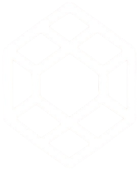

<div align="center">
    
</div>

# TokenTrove - NFT Showcase & Creation Platform


Welcome to TokenTrove, a modern web application for showcasing and creating NFTs. Built with a powerful stack including Next.js, Alchemy API, and Google's Gemini API, this platform provides a seamless experience for exploring the world of digital collectibles.

## ✨ Core Features

- **NFT Creation**: A user-friendly form to (simulate) the creation of new NFTs.
- **AI Content Moderation**: An AI-powered assistant to help you craft marketplace-ready descriptions and traits for your NFTs.
- **Dynamic NFT Gallery**: Browse NFT collections from any Ethereum wallet address or ENS name. The gallery fetches real-time data from the blockchain via the Alchemy API.
- **Detailed NFT View**: Click on any NFT in the gallery to see its details, including attributes, description, and a link to its OpenSea page.
- **AI Chat Assistant**: Have a question about NFTs, blockchain, or Web3? Chat with our integrated AI assistant, powered by the Google Gemini API, to get instant answers.
- **Responsive Design**: A beautiful and intuitive interface that works seamlessly on both desktop and mobile devices.
- **Modern Animations**: Smooth page transitions and subtle animations powered by Framer Motion and Next View Transitions.

## 🛠️ Tech Stack

- **Framework**: [Next.js](https://nextjs.org/) (with App Router)
- **Language**: [TypeScript](https://www.typescriptlang.org/)
- **Styling**: [Tailwind CSS](https://tailwindcss.com/)
- **UI Components**: [ShadCN UI](https://ui.shadcn.com/)
- **Blockchain Data**: [Alchemy NFT API](https://www.alchemy.com/nft-api)
- **AI Assistant**: [Google Gemini API](https://ai.google.dev/)
- **Animations**: [Framer Motion](https://www.framer.com/motion/) & [Next View Transitions](https://github.com/shuding/next-view-transitions)
- **State Management**: [Zustand](https://github.com/pmndrs/zustand)

## 🚀 Getting Started

To get a local copy up and running, follow these simple steps.

### Prerequisites

- [Node.js](https://nodejs.org/en/) (v18 or later)
- [npm](https://www.npmjs.com/) or [yarn](https://yarnpkg.com/)

### Installation & Setup

1.  **Clone the repository:**
    ```sh
    git clone https://github.com/Jyotibrat/Token-Trove.git
    cd tokentrove
    ```

2.  **Install dependencies:**
    ```sh
    npm install
    ```

3.  **Set up environment variables:**

    Create a file named `.env` in the root of your project and add the following variables. You will need API keys from Alchemy and Google AI Studio.

    ```env
    # Get your key from https://www.alchemy.com/
    NEXT_PUBLIC_ALCHEMY_API_KEY=your_alchemy_api_key

    # Get your key from https://ai.google.dev/
    NEXT_PUBLIC_GEMINI_API_KEY=your_gemini_api_key
    ```

4.  **Run the development server:**
    ```sh
    npm run dev
    ```

Open [http://localhost:3000](http://localhost:3000) with your browser to see the result.

## 🤝 Contributing

Contributions are what make the open-source community such an amazing place to learn, inspire, and create. Any contributions you make are **greatly appreciated**.

If you have a suggestion that would make this better, please fork the repo and create a pull request. You can also simply open an issue with the tag "enhancement".

1.  **Fork the Project**
2.  **Create your Feature Branch** (`git checkout -b feature/AmazingFeature`)
3.  **Commit your Changes** (`git commit -m 'Add some AmazingFeature'`)
4.  **Push to the Branch** (`git push origin feature/AmazingFeature`)
5.  **Open a Pull Request**

Check out the `/contribute` page on the live site for more details on the project structure and guidelines.
